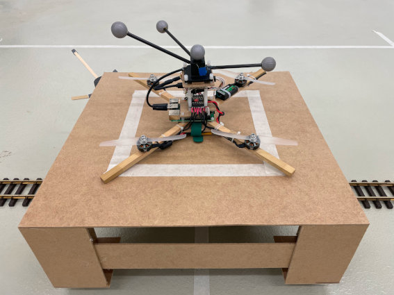

# Reinforcement Learning based Autonomous Multi-Rotor Landing on Moving Platforms


Welcome to the repository providing the code used for the paper 

**Reinforcement Learning based Autonomous Multi-Rotor Landing on Moving Platforms**

by Pascal Goldschmid and Aamir Ahmad.

The paper is available [as open access publication](https://link.springer.com/article/10.1007/s10514-024-10162-8) in the journal [Springer - Autonomous Robots](https://link.springer.com/journal/10514) 


Experimental data (training results, training log data, rosbag files and videos of the real flight experiments) can be downloaded [here](https://keeper.mpdl.mpg.de/d/e11b95eb92ec46bfb2d2/).

If you have any questions, comments or suggestions please contact pascal.goldschmid@ifr.uni-stuttgart.de
#
 

If you use or work, please cite it as 

```
@article{cite-key,
	author = {Goldschmid, Pascal and Ahmad, Aamir},
	date = {2024/06/06},
	doi = {10.1007/s10514-024-10162-8},
	id = {Goldschmid2024},
	isbn = {1573-7527},
	journal = {Autonomous Robots},
	number = {4},
	pages = {13},
	title = {Reinforcement learning based autonomous multi-rotor landing on moving platforms},
	url = {https://doi.org/10.1007/s10514-024-10162-8},
	volume = {48},
	year = {2024},
	bdsk-url-1 = {https://doi.org/10.1007/s10514-024-10162-8}}

```

---
## General
### Scope of the code
The code has been developed with Python 3 on Ubuntu 20, using ROS Noetic and Gazebo 11. It provides all necessary scripts to set up the RL training environment in Gazebo. Furthermore, it contains all necessary files to apply the sequential curriculum used to train agents for different scenarios. It is possible to run several trainings in parallel in independent simulations. Furthermore, the repository contains all files necessary to deploy an agent on real hardware. 

### Structure of the repository
The repository provides three folders that contain the files to set up a ROS catkin workspace for training and evaluation in simulation ([rl_multi_rotor_landing_sim](rl_multi_rotor_landing_sim)) or for deploying an agent on real hardware. For the latter, one catkin workspace needs to be created on a computer acting as ground control station ([rl_multi_rotor_landing_gcs](rl_multi_rotor_landing_gcs)) and the other one ([rl_multi_rotor_landing_uav](rl_multi_rotor_landing_uav)) has to be run on the UAV. Dependencies are installed in the [submodules](submodules) folder. Code used in more than one catkin workspace is found in the [src](src) folder.

### Structure of the code
The code is designed in a way that each ROS node is run in a separate virtual screen. To get a list of all virtual screens that are currently active, run
```
screen -list
```
To attach to a screen, use 
```
screen -r SCREEN_NAME
```
To detach from a screen, press ctrl+a and then ctrl+d.

## Requirements
### Linux packages
Install some basic packages first by running the commands
```
sudo apt update
sudo apt install libgoogle-glog-dev
sudo apt install screen
sudo apt install python3-pip
```
### Downloading the code
The repository includes several submodules that need to be considered during download. This can be achieved with the following command
```
git clone --recurse-submodules https://github.com/robot-perception-group/rl_multi_rotor_landing.git
```

## Installation
### Installing ROS and Gazebo
You can find the installation instructions for ROS Noetic and Gazebo  [here](http://wiki.ros.org/noetic/Installation/Ubuntu).
A list of required ROS packages is given [here](ros_packages_list.txt). You can install a package by using apt as follows
```
sudo apt install ros-noetic-PACKAGE-NAME
```
### Installing Python modules and setting up the use of virtual environments
A list of required additional python modules is given [here](requirements.txt). You can install it by running
```
pip3 install -r requirements.txt
```
If you are using a virtual environment or need to adapt your ```PYTHONPATH``` variable please update [this](rl_multi_rotor_landing_sim/other_files/activate_training_venv.sh) file according to your needs for the respective catkin workspace.
Activate the virtual environment then by running
```
source ~/rl_multi_rotor_landing/rl_multi_rotor_landing_sim/other_files/activate_training_venv.sh
```

### Initializing the catkin workspaces
Make sure ROS is installed, then run
```
cd ~/rl_multi_rotor_landing
./init_workspaces.sh
```

## Running the code - quick start
For a quick start, you can test the training procedure in simulation.

### Setting up a training environment
Prepare the catkin workspace first by running the following commands
```
cd ~/rl_multi_rotor_landing/rl_multi_rotor_landing_sim
catkin_make
source other_files/setup.bash
```
In any other terminal window in which you wish to run any function related to this workspace, run the above source command first.
You can launch the simulation environment by running 

```
cd ~/rl_multi_rotor_landing/rl_multi_rotor_landing_sim
./src/training_q_learning/launch/launch_environment_in_virtual_screens.sh SIM_ID UAV_NAME ROS_PORT GAZEBO_PORT
```
Define the name of your environment by the parameter ```SIM_ID```. The parameter ```UAV_NAME``` can be used to select a vehicle from the [RotorS](https://github.com/ethz-asl/rotors_simulator) package. We used the UAV called "hummingbird". ```ROS_PORT``` and ```GAZEBO_PORT``` are required to run several indepedent trainings in simulation at the same time. For each training, select a unique pair of ports. For ```ROS_PORT```, a working value range constitute the integers 11311 - 11316 whereas for ```GAZEBO_PORT``` it is 11351 - 11356. An example to launch the simulation is
```
cd ~/rl_multi_rotor_landing/rl_multi_rotor_landing_sim
./src/training_q_learning/launch/launch_environment_in_virtual_screens.sh test_sim hummingbird 11311 11351
```
To run commands such as ```rostopic list``` in a different terminal window, execute first
```
cd ~/rl_multi_rotor_landing/rl_multi_rotor_landing_sim
source other_files/setup.bash
source other_files/prepare_terminal_window.sh ROS_PORT GAZEBO_PORT
```
where ROS_PORT and GAZEBO_PORT need to match the values used for launching the simulation environment.


### Training an agent
There are several steps to be executed during the training curriculum.

 1. Launch the simulation training environment as described above. Then run the first step of the curriculum with 
    ```
    cd ~/rl_multi_rotor_landing/rl_multi_rotor_landing_sim
    ./src/training_q_learning/launch/launch_training.sh hummingbird 11311 11351
    ```
 2. After the training has finished, increment the value of the parameter ```number_new_curriculum_steps``` by 1 in the [parameters](rl_multi_rotor_landing_sim/src/training_q_learning/src/training_q_learning/parameters.py) file.    

 3. Update the parameter ```load_data_from``` in the [parameters](rl_multi_rotor_landing_sim/src/training_q_learning/src/training_q_learning/parameters.py) file with the path to the latest results that have been stored.  
    By default, the training results are stored [here](rl_multi_rotor_landing_sim/src/training_q_learning/training_results).
    An example path can look like this 
    ```
    "~/rl_multi_rotor_landing/src/training_q_learning/training_results/training_q_learning_1/episode_2007_FINAL"
    ```

 4. Increment the value of the parameter ```curriculum_step``` by 1 in the [parameters](rl_multi_rotor_landing_sim/src/training_q_learning/src/training_q_learning/parameters.py) file.

 5. Set the value of ```init_distribution ``` to ```uniform``` in the in the [parameters](rl_multi_rotor_landing_sim/src/training_q_learning/src/training_q_learning/parameters.py) file.

 6. Replace the value of the variable ```exploration_rate_schedule``` in the [parameters](rl_multi_rotor_landing_sim/src/training_q_learning/src/training_q_learning/parameters.py) file with ```{0:["lin",0,1,0,0]}```
 7. Restart the training for the next curriculum step by running 
    ```
    cd ~/rl_multi_rotor_landing/rl_multi_rotor_landing_sim
    ./src/training_q_learning/launch/launch_training.sh hummingbird 11311 11351
    ```  
 With the default settings, you can repeat the steps 3 to 7 four times to obtain a fully trained agent.
 The script [execute_training_curriculum_for_one_sim_one_exp.py](rl_multi_rotor_landing_sim/other_files/execute_training_curriculum_for_one_sim_one_exp.py) automates these steps.


### Testing an agent
To test an agent in simulation, update the value ```load_data_from``` in the [parameters](rl_multi_rotor_landing_sim/src/training_q_learning/src/training_q_learning/parameters.py) file with the path to the latest result. Furthermore, replace the respective parameters with the following values
```
self.initial_action_values: dict = {"pitch":0,  #[rad]
                              "roll":0,         #[rad]
                              "v_z":-0.1,       #[m/s]
                              "yaw":np.pi/4     #[rad]
                              }
self.init_distribution = 'uniform'   
self.init_altitude: float = 2.5
self.minimum_altitude: float = 0.1
self.done_criteria: dict = {
        "max_lon_distance" : True,  #Bool
        "max_lat_distance" : True,  #Bool
        "max_ver_distance" : True,  #Bool
        "max_num_timesteps" : True, #Bool
        "minimum_altitude" : True, #Bool
        "touchdown_contact" : True, #Bool
        "success" : False,   #Bool
}

```

Run the script 
```
cd rl_multi_rotor_landing/rl_multi_rotor_landing_sim
./src/training_q_learning/launch/launch_test_model_2D.sh hummingbird 11311 11351
```
You can run an [analysis script](rl_multi_rotor_landing_sim/src/training_q_learning/scripts/analysis_node_2D.py) in parallel. In that script, adapt the path to the location of the log file and the platform size according to your needs. Then, execute
```
cd ~/rl_multi_rotor_landing/rl_multi_rotor_landing_sim
./src/training_q_learning/scripts/training/launch_analysis_node_2D.sh hummingbird 11311 11351
```
You can use one of the scripts provided in the folder [experiment_evaluation](experiment_evaluation)  to determine the [success rate](experiment_evaluation/success_determination.py) or [duration of training](experiment_evaluation/analyze_training_time.py) of the agent. Specify the platform size as well as the path to the file previously logged with the [analysis script](rl_multi_rotor_landing_sim/src/training_q_learning/scripts/analysis_node_2D.py).

## Running a custom training
Running a custom setup requires several parameters in the [parameters](rl_multi_rotor_landing_sim/src/training_q_learning/src/training_q_learning/parameters.py) file to be adapted. To determine their values required by the multi-resolution discretization scheme as described in the paper, you can run the script [compute_training_parameters.py](rl_multi_rotor_landing_sim/other_files/compute_training_parameters.py).
Furthermore, you need to specifiy the properties of the rectilinear periodic movement (radius and velocity) to be performed by the platform during training in the file [landing_simulation.launch](rl_multi_rotor_landing_sim/src/training_q_learning/launch/landing_simulation.launch).

## Running the cascaded PI controller
Besides the RL approach, also a cascaded PI controller is implemented. In order to run it, the following set of commands has to be executed.
```
cd ~/rl_multi_rotor_landing/rl_multi_rotor_landing_sim
source other_files/setup.bash
./src/training_q_learning/launch/launch_cascaded_pid_environment_in_virtual_screens.sh SIM_ID UAV_NAME ROS_PORT GAZEBO_PORT
```
Replace SIM_ID, UAV_NAME, ROS_PORT and GAZEBO_PORT with suitable values (see above for an example). This opens the Gazebo simulator with all required ROS nodes running in virtual screens.
In a new terminal window run 
```
source other_files/setup.bash
source other_files/prepare_terminal_window.sh ROS_PORT GAZEBO_PORT
roslaunch training_q_learning all_cascaded_pid_controllers.launch
```
 Replace ROS_PORT, and GAZEBO_PORT values matching those of the previously launched scripts. This launches a ROS node creating and running the different instances of the PID controllers. The respective controller gains can be set in the file [all_cascaded_pid_controllers.launch](/rl_multi_rotor_landing_sim/src/training_q_learning/launch/all_cascaded_pid_controllers.launch).
In another terminal run
```
source other_files/setup.bash
source other_files/prepare_terminal_window.sh ROS_PORT GAZEBO_PORT
roslaunch training_q_learning test_cascaded_pid.launch drone_name:=UAV_NAME
```
 Replace ROS_PORT, GAZEBO_PORT and UAV_NAME values matching those of the previously launched scripts. This launches the automatic reset of the UAV after the completion of a landing attempt. The corresponding parameters regarding initial altitude, size of fly zone, etc. can be specified in the [parameter file](/rl_multi_rotor_landing_sim/src/training_q_learning/src/training_q_learning/parameters.py).
The successful and failed landing attempts can be logged with the analysis script as described above. For evaluation of the log file, you can use [this](/experiment_evaluation/success_determination_cascaded_pid.py) script.


# Setting up an experiment on real hardware
## General
To evaluate an agent on real hardware, a Vicon system is required that is able to track the position and orientation of the UAV and the moving platform using marker detection. ROS nodes are provided that open an interface to the Vicon system to retrieve the required pose and twist data and publish it on the ROS network. Being equipped with a Raspberry Pi 4B running Ubuntu 20, the UAV is able to use this information as a fake GPS signal for the state estimation performed by the onboard flight controller. The RL agent to be evaluated is executed on a desktop computer running the [LibrePilot](https://www.librepilot.org/site/index.html) Ground Control Station that is used to switch between the different flight modes (manual attitude control, manual velocity control and RL agent), receive telemetry data from the FC and set up virtual limits for the fly zone for safety purposes.

 


## Installation
### Preparing the Vicon system
In order to function properly, the moving platform must be named *moving_platform_1* and the UAV must be named *copter_1* in the Vicon system.

### Preparing the ground control station
Download the code and initialize the workspaces as described above on the computer used as ground control station (gcs). 
Prepare the catkin workspace of the gcs by running 
```
cd ~/rl_multi_rotor_landing/rl_multi_rotor_landing_gcs
catkin_make
source other_files/setup.bash
```
Follow these [steps](rl_multi_rotor_landing_gcs/other_files/librepilot_installation.txt) to install the LibrePilot gcs on your computer. 
You can launch the gcs by running 
```
cd ~/rl_multi_rotor_landing/submodules/LibrePilot
./build/librepilot-gcs_release/bin/librepilot-gcs 
```
Click on *File --> GCS settings Import/Export* and import [this](rl_multi_rotor_landing_gcs/other_files/gcs_settings_for_copter.xml) file to load the required configuration of the 
gcs. In *Tools --> Options --> IP Network Telemetry* enter the IP address of the Raspberry 4B of the UAV in the field *Host Name/Number* and choose the option *TCP*.

In our experiments, we connected the gcs computer via ethernet with the Vicon base station. Connection to the UAV is achieved via a Wi-Fi hotspot that is provided by an external access point.
To create a connection to the Vicon base computer, install the ROS-package that provides a bridge to the Vicon system.
```
sudo apt update
sudo apt install ros-noetic-vrpn-client-ros
```
In [this](rl_multi_rotor_landing_gcs/src/training_q_learning/launch/launch_vicon_bridge.sh) file, update the IP address with the IP address of your Vicon base computer.

Navigate to the launch directory of the vrpn_client_ros-package 
```
roscd vrpn_client_ros/launch
```
Create a file named *landing_on_moving_platform.launch* with the following content
```
<launch>

  <arg name="server" default="localhost"/>

  <node pkg="vrpn_client_ros" type="vrpn_client_node" name="vrpn_client_node" output="screen">
    <rosparam subst_value="true">
      server: $(arg server)
      port: 3883

      update_frequency: 100.0
      frame_id: world

      # Use the VRPN server's time, or the client's ROS time.
      use_server_time: false
      broadcast_tf: true

      # Must either specify refresh frequency > 0.0, or a list of trackers to create
      refresh_tracker_frequency: 1.0
      #trackers:
      #- FirstTracker
      #- SecondTracker
    </rosparam>
    <remap from="/vrpn_client_node/moving_platform_1/accel" to="/vicon/moving_platform/accel_enu"/>
    <remap from="/vrpn_client_node/moving_platform_1/pose" to="/vicon/moving_platform/pose_enu"/>
    <remap from="/vrpn_client_node/moving_platform_1/twist" to="/vicon/moving_platform/twist_enu"/>
    
    <remap from="/vrpn_client_node/copter_1/accel" to="/vicon/drone/accel"/>
    <remap from="/vrpn_client_node/copter_1/pose" to="/vicon/drone/pose"/>
    <remap from="/vrpn_client_node/copter_1/twist" to="/vicon/drone/twist"/>
  </node>

</launch>
```

### Preparing the UAV
Install the code on the copter that you plan to use and set it up to automatically connect to the same WiFi as the LibrePilot gcs. Initialize the workspaces as described above.
Prepare the catkin workspace on the UAV by running 
```
cd ~/rl_multi_rotor_landing/rl_multi_rotor_landing_uav
catkin_make
source other_files/setup.bash
```
To make sure that the ROS network is initiated as soon as the UAV is powered up, you can set up [this](rl_multi_rotor_landing_uav/other_files/launch_bridges_in_virtual_screens.sh) script to be executed automatically (e.g. as a cron job) during the boot sequence.

For our experiments, we equipped the UAV with a LibrePilot Revolution Flight Controller. After creating a connection to the FC using the gcs, you can import the [configuration file](rl_multi_rotor_landing_gcs/other_files/copter_settings_landing.uav) in the gcs by clicking on *File--> Import UAV Settings*. 

### Setting up the moving platform
For this project, we used [this](https://github.com/robot-perception-group/moving_platform_control.git) package to realize a platform moving autonomously on rails. For this purpose, a model train that pulls a wooden platform structure on wheels is controlled via ROS. For more details you can look through the package's readme. 

## Conducting the flight experiment using the RL controller
Power up the UAV. Make sure that the Vicon system is able to detect both objects, the moving platform and the copter.
Then, launch the ROS nodes by running 
```
cd ~/rl_multi_rotor_landing/rl_multi_rotor_landing_gcs
./src/training_q_learning/launch/launch_vicon_environment_in_virtual_screens.sh vicon copter 11311 11351
```
Prepare the RL agent to be executed whenever the command is given by the remote control or the gcs.
```
cd ~/rl_multi_rotor_landing/rl_multi_rotor_landing_gcs
./rl_multi_rotor_landing_gcs/src/training_q_learning/launch/launch_vicon_test_model_2D.sh copter 11311 11351
```
Now you can take-off, bring the UAV into a hover state within the fly zone and activate the cascaded PI controller. Deactivate it as soon as the copter is close to the moving platform since a touchdown controller with motor deactivation is not implemented.


## Conducting the flight experiment using the cascaded PI controller
Power up the UAV. Make sure that the Vicon system is able to detect both objects, the moving platform and the copter.
Then, launch the ROS nodes by running 
```
cd ~/rl_multi_rotor_landing/rl_multi_rotor_landing_gcs
./src/training_q_learning/launch/launch_vicon_environment_in_virtual_screens.sh vicon copter 11311 11351
```
Launch the cascaded PID controller interface in a new terminal by running
```
cd ~/rl_multi_rotor_landing/rl_multi_rotor_landing_gcs
source other_files/setup.bash
source other_files/prepare_terminal_window.sh 11311 11351
roslaunch training_q_learning vicon_cascaded_pid_interface.launch
```
Launch the cascaded PI controller in a new terminal window by running
```
cd ~/rl_multi_rotor_landing/rl_multi_rotor_landing_gcs
source other_files/setup.bash
source other_files/prepare_terminal_window.sh 11311 11351
roslaunch training_q_learning vicon_all_cascaded_pid_controllers.launch yaw:=0.78539 v_z:=0.1
```
By means of the parameters *yaw* and *v_z* you can set the orientation around the vertical axis of the UAV in rad as well as the vertical descend velocity in m/s (positive values indicate descend).
Now you can take-off, bring the UAV into a hover state within the fly zone and activate the RL agent. Deactivate it as soon as the copter is close to the moving platform since a touchdown controller with motor deactivation is not implemented.

## Logging flight data
You can record a rosbag file during the flight experiments.
For this purpose, run the following commands in a terminal window on the gcs laptop.

```
cd ~/rl_multi_rotor_landing/rl_multi_rotor_landing_gcs
source other_files/setup.bash
bash other_files/record_rosbag.bash <Your Flight Experiment ID name>
```

## Analyzing flight logs
You can make the recorded rosbag file accessible to further processing in python by executing the script [extract_topics_from_rosbag.py](experiment_evaluation/extract_topics_from_rosbag.py). It will extract the required topics from the rosbag file and store them as .csv-files in a subdirectory with the same name as the flight experiment ID that was used for the rosbag file.
To extract individual flights from these topics, run [extract_flights_from_rosbag_topics.py](experiment_evaluation/extract_flights_from_rosbag_topics.py).
The flights can be plotted using the gnuplot script [plot_vicon_flight_from_drone_state_estimate.gnuplot](experiment_evaluation/plot_vicon_flight_from_drone_state_estimate.gnuplot).
Success determination needs to be done manually, i.e. the number of landing trials leading to a successful touchdown needs to be counted.


**Disclaimer**

THIS SOFTWARE IS PROVIDED BY THE COPYRIGHT HOLDERS AND CONTRIBUTORS "AS IS" AND ANY EXPRESS OR IMPLIED WARRANTIES, INCLUDING, BUT NOT LIMITED TO, THE IMPLIED WARRANTIES OF MERCHANTABILITY AND FITNESS FOR A PARTICULAR PURPOSE ARE DISCLAIMED. IN NO EVENT SHALL THE COPYRIGHT HOLDER OR CONTRIBUTORS BE LIABLE FOR ANY DIRECT, INDIRECT, INCIDENTAL, SPECIAL, EXEMPLARY, OR CONSEQUENTIAL DAMAGES (INCLUDING, BUT NOT LIMITED TO, PROCUREMENT OF SUBSTITUTE GOODS OR SERVICES; LOSS OF USE, DATA, OR PROFITS; OR BUSINESS INTERRUPTION) HOWEVER CAUSED AND ON ANY THEORY OF LIABILITY, WHETHER IN CONTRACT, STRICT LIABILITY, OR TORT (INCLUDING NEGLIGENCE OR OTHERWISE) ARISING IN ANY WAY OUT OF THE USE OF THIS SOFTWARE, EVEN IF ADVISED OF THE POSSIBILITY OF SUCH DAMAGE.
